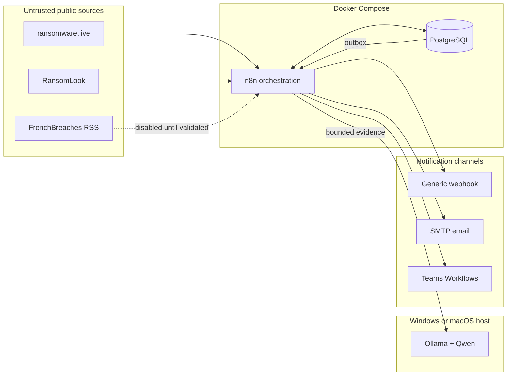

# 🛡️ Threat Claim Monitor

> Self-hosted monitoring of public ransomware and data-leak claims, with deterministic organization matching, local AI summaries, and auditable notifications.


## 📖 Overview

Threat Claim Monitor is an open-source defensive Cyber Threat Intelligence project designed to detect when a monitored organization appears in a public ransomware or data-leak claim.

The platform collects structured OSINT feeds, preserves the original observation, correlates duplicates, applies deterministic matching rules, and produces a concise notification for security teams. A local language model can summarize the available evidence, but it never decides whether an organization matches and never promotes a criminal claim to a confirmed incident.

The initial monitored organizations are:

- Capifrance
- Optimhome
- Digit RE Group

The watchlist is stored in PostgreSQL and can be extended without changing workflow code.

## 🎯 Problem statement

Ransomware groups and data-leak actors publish claims across many channels. Manual monitoring is repetitive, coverage varies by analyst availability, and the same event is frequently repeated by several aggregators.

Threat Claim Monitor turns that fragmented stream into a controlled detection pipeline:

1. collect public metadata;
2. normalize each source into one internal contract;
3. preserve source-level evidence;
4. correlate repeated observations;
5. match approved organization names, aliases, and domains;
6. summarize only the supplied evidence;
7. notify once per meaningful evidence version;
8. retain an auditable history.

## ✨ V1 capabilities

| Capability | Design |
|---|---|
| Multi-source collection | Independent n8n adapters for JSON APIs and RSS feeds |
| Silent baseline | Existing records are imported without generating an alert storm |
| Deduplication | PostgreSQL uniqueness constraints plus deterministic correlation rules |
| Organization matching | Exact domains, official names, and explicitly approved aliases |
| Confidence | Rule-based match score, separate from incident verification status |
| Local AI | Schema-constrained Ollama summary with deterministic fallback |
| Notification | Transactional outbox for webhook, email, and Teams delivery |
| Auditability | Source observations, analyses, evidence versions, and attempts retained |
| Extensibility | Source and channel adapters remain independent of the core data model |

## 🧭 What the system does — and does not claim

A ransomware post is an allegation made by a threat actor. It is not proof that the victim was compromised, that the claimed data is authentic, or that the described impact is accurate.

Threat Claim Monitor therefore separates two concepts:

- **match confidence** answers “how strongly does this record refer to a monitored organization?”;
- **verification status** answers “what kind of evidence currently supports the claim?”.

Possible verification states are `claimed`, `multi_source_observed`, `officially_confirmed`, `disputed`, and `refuted`. Observation by two aggregators is useful corroboration of publication, but is not an independent confirmation of compromise.

## 🏗️ Architecture



The default deployment contains only n8n and PostgreSQL. Ollama runs natively on the host so Apple Silicon and Windows installations can use native acceleration.

Read the complete [architecture documentation](docs/architecture/architecture.md), [data model](docs/architecture/data-model.md), and [threat model](docs/security/threat-model.md).

## 📡 Source strategy

| Source | Format | V1 role | State |
|---|---|---|---|
| ransomware.live | JSON API | Primary claim feed | Adapter implemented; M1 hardening in progress |
| RansomLook | JSON API and RSS | Secondary observation and correlation | Seeded; adapter planned in M5 |
| FrenchBreaches | RSS advertised | French breach enrichment | Seeded, disabled pending validation |
| CERT-FR | RSS / CTI publications | Future institutional confirmation | Planned |
| Have I Been Pwned | RSS / API | Future verified breach enrichment | Planned |

HTML scraping is excluded whenever a structured public feed is available. Direct access to criminal infrastructure and downloading leaked material are outside the V1 scope.

## 🧩 Technology stack

| Area | Technology | Responsibility |
|---|---|---|
| Orchestration | n8n 2.32.6 | Scheduling, adapters, retries, processing and dispatch |
| Relational storage | PostgreSQL 17.10 | Evidence, configuration, correlation and notification state |
| Local inference | Ollama | Host-native model serving |
| Reference model | Qwen3 8B Q4_K_M | French-language structured summarization |
| Runtime | Docker Compose | Reproducible Windows and macOS services |
| CI | GitHub Actions | Configuration and repository validation |
| Documentation | Markdown and Mermaid | Architecture, operations and decisions |

Versions are pinned in `.env.example` and updated deliberately through reviewed pull requests.

## 📂 Repository structure

```text
.
├── .github/
│   ├── ISSUE_TEMPLATE/       Structured bugs, features, and implementation tasks
│   └── workflows/            Continuous integration
├── db/
│   └── migrations/           Ordered application schema migrations
├── docs/
│   ├── architecture/         System design, data model, and ADRs
│   ├── development/          Windows and macOS development guides
│   ├── operations/           Installation, health, and recovery procedures
│   └── security/             Threat model and trust boundaries
├── infra/
│   └── postgres/init/        First-start database initialization
├── n8n/
│   └── workflows/            Version-controlled workflow exports
├── scripts/                  Cross-platform repository validation
├── .env.example              Safe configuration template
├── docker-compose.yml        Local reference deployment
└── ROADMAP.md                Milestones and acceptance criteria
```

## 🚀 Quick start

### Prerequisites

- Windows 11 or macOS on Apple Silicon
- Docker Desktop with Docker Compose v2
- 4 GB of free memory for the foundation stack
- Ollama only from Milestone 3 onward

### Windows

```powershell
Copy-Item .env.example .env
# Replace both change-me values in .env
powershell -NoProfile -ExecutionPolicy Bypass -File scripts/validate.ps1
docker compose up -d
```

### macOS

```sh
cp .env.example .env
# Replace both change-me values in .env
sh scripts/validate.sh
docker compose up -d
```

Open <http://localhost:5678> and create the local n8n owner account. PostgreSQL initializes the n8n database, the application database, migration history, monitored organizations, aliases, and initial sources on first start.

See the [installation guide](docs/operations/getting-started.md) and platform-specific development guides for [Windows](docs/development/windows.md) and [macOS](docs/development/macos.md).

## 📊 Project status

| Milestone | Scope | Status |
|---|---|---|
| M0 | Repository, Compose, schema, ADR, documentation, CI | ✅ Complete; runtime validated on macOS |
| M1 | ransomware.live collection and silent baseline | ✅ Complete; runtime validated on Windows |
| M2 | Deterministic matching and claim correlation | ✅ Complete; runtime validated on Windows |
| M3 | Evidence-grounded Ollama structured analysis | ✅ Complete; fallback and valid inference paths runtime-validated on Windows |
| M3.1 | Hybrid Ollama and Microsoft Foundry inference | 🚧 In progress; architecture and provider contract defined |
| M4 | Auditable webhook, email, and Teams notifications | ⏳ Next; common contract, transactional dispatch, retries, and delivery history |
| M5 | Additional source adapters | Planned |
| M6 | Hardening and v1.0.0 | Planned |

The detailed acceptance criteria are tracked in the [roadmap](ROADMAP.md).

## 🔐 Security principles

- Public metadata only; no leaked datasets or stolen files.
- All CTI content is treated as untrusted input.
- PostgreSQL is isolated from the host network.
- n8n binds to localhost in the reference deployment.
- Secrets remain in the ignored `.env` file or n8n credential store.
- AI output cannot alter matching, confidence, verification, or routing.
- Synthetic and redacted fixtures are mandatory for tests and demonstrations.

Read [SECURITY.md](SECURITY.md) before deploying or contributing.

## 📚 Documentation

The [documentation portal](docs/README.md) provides the recommended reading path and a complete index.

Key documents:

- [Architecture](docs/architecture/architecture.md)
- [Data model](docs/architecture/data-model.md)
- [ADR-0001](docs/architecture/adr/0001-minimal-v1-architecture.md)
- [Threat model](docs/security/threat-model.md)
- [Getting started](docs/operations/getting-started.md)
- [Infrastructure notes](infra/README.md)
- [Contributing](CONTRIBUTING.md)

## 💡 Engineering philosophy

- Build a useful V1 before adding platform features.
- Prefer deterministic controls over probabilistic decisions.
- Preserve evidence and uncertainty instead of manufacturing certainty.
- Make retries safe and state transitions auditable.
- Keep the deployment understandable by one engineer.
- Document decisions when they constrain future implementation.

## 🤝 Contributing

Contributions and constructive reviews are welcome. Start with [CONTRIBUTING.md](CONTRIBUTING.md), use a structured issue, and keep pull requests focused on one observable outcome.

## ⚠️ Disclaimer

Threat Claim Monitor is a defensive monitoring and educational project. A generated alert must be validated by a qualified analyst before operational, legal, or public action is taken. Users remain responsible for complying with source terms, privacy requirements, and applicable law.

## 📜 License

Released under the [MIT License](LICENSE).
