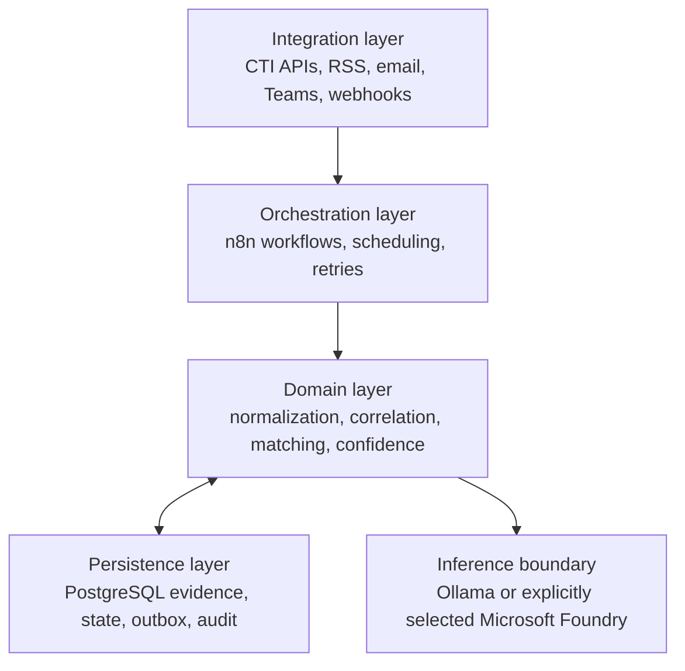
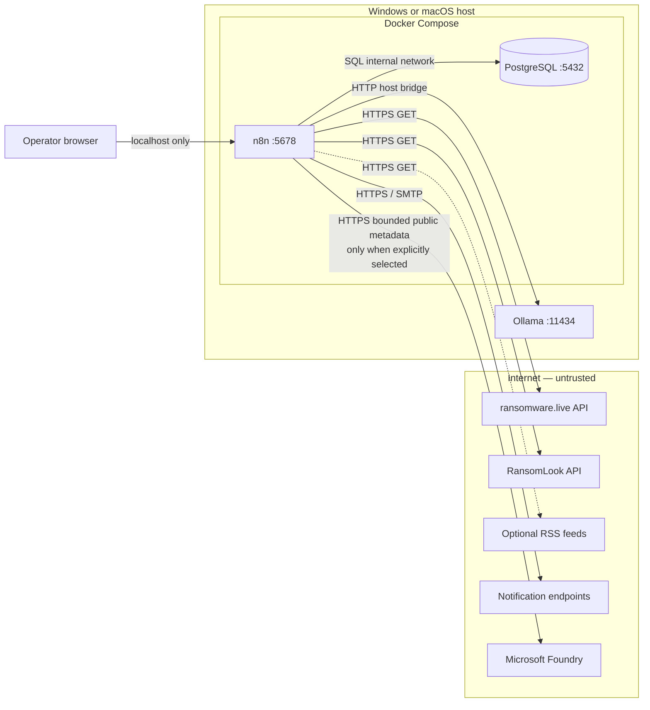
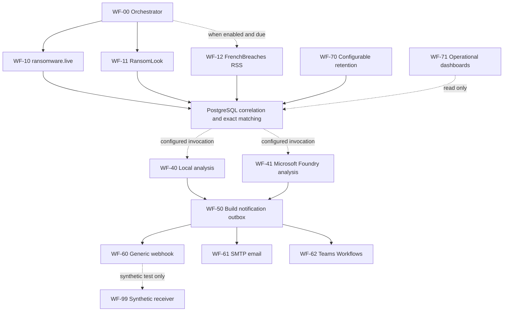
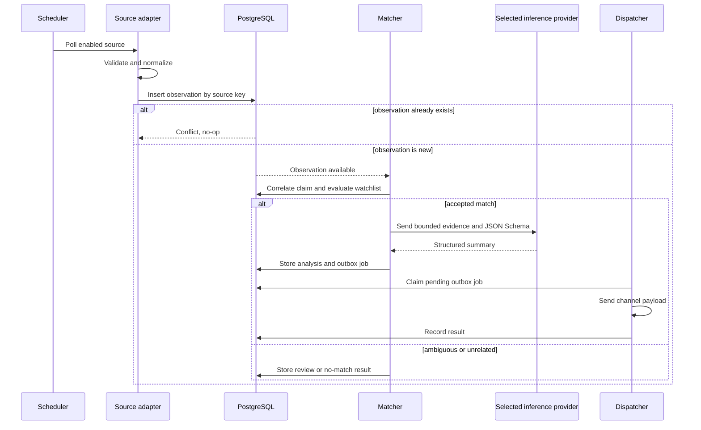
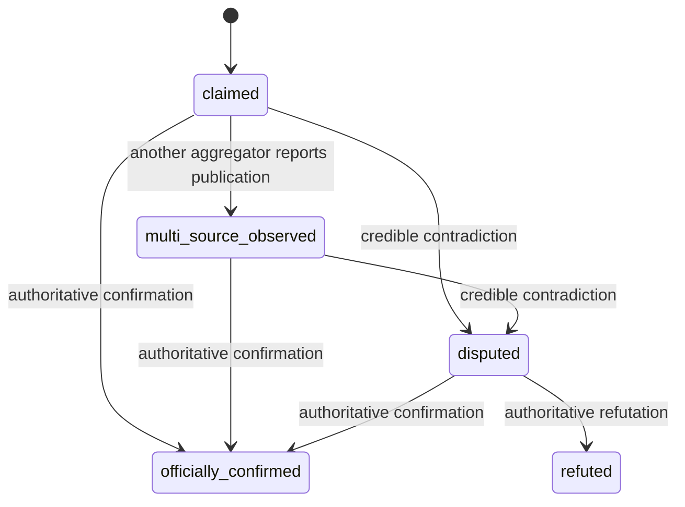
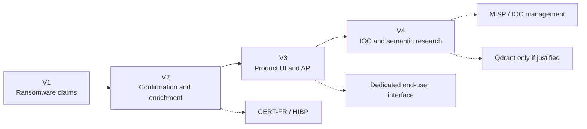

# 🏗️ System architecture

## Overview

Threat Claim Monitor is a single-host CTI automation system. It monitors structured public sources for ransomware and data-leak claims, correlates repeated observations, detects references to a configured organization watchlist, and notifies security teams with explicit uncertainty.

The architecture is intentionally small enough for one engineer to operate while preserving professional properties:

- durable state;
- idempotent ingestion;
- source isolation;
- deterministic alert decisions;
- replaceable local or explicitly selected cloud inference;
- auditable delivery;
- cross-platform deployment;
- documented evolution.

## Architectural drivers

| Driver | Architectural response |
|---|---|
| One developer | Two containerized services and no custom microservice in V1 |
| Windows and Apple Silicon | Multi-architecture images, host-native Ollama, and optional HTTPS Foundry inference |
| Unreliable external feeds | Independent adapters, retries, health state, and raw evidence retention |
| Duplicate reporting | Source uniqueness constraints and canonical claim correlation |
| High false-positive cost | Exact matching for automatic alerts; ambiguity goes to review |
| Untrusted CTI content | Validation, bounded storage, prompt isolation, and no model authority |
| Notification retries | PostgreSQL transactional outbox and attempt history |
| Portfolio quality | Versioned workflows, migrations, ADRs, CI, and operational documentation |

## Design principles

### Evidence before interpretation

The source observation is stored before matching, summarization, or notification. Derived records always link back to their evidence.

### Deterministic decisions

Organization matching, match confidence, verification status, deduplication, and notification routing use explicit rules. Language-model prose cannot change them.

### Claims are not incidents

The platform records what a source reported. It never equates publication on a criminal site with confirmed compromise.

### Minimum useful infrastructure

V1 excludes components that do not solve a current requirement. Qdrant, RAG,
Redis, Kubernetes, a public API, and a custom end-user interface remain outside
the deployment. Read-only operational SQL views and a manual n8n inspection
workflow are included for operators.

### Safe retries

Network operations can fail at any point. Database constraints and outbox keys make replay safe at the application level and preserve enough state for investigation.

### Replaceable edges

Source and notification integrations are adapters around a stable internal contract. Adding a feed or delivery channel does not redesign the core pipeline.

## Logical layers

The domain layer is implemented initially through explicit n8n transformations and parameterized SQL. If complexity later justifies a dedicated application service, the database contract and workflow interfaces provide the extraction boundary.

## Reference deployment

The repository contains 13 sanitized, inactive workflow exports. A new n8n
database does not import them automatically; follow
[Workflow deployment](../operations/workflow-deployment.md) after starting the
containers.

## Component responsibilities

### n8n

Responsibilities:

- scheduled workflow execution;
- source-specific HTTP and RSS collection;
- schema validation and normalization;
- orchestration of SQL operations;
- retry and error workflows;
- Ollama request construction and output validation;
- notification dispatch;
- workflow-level metrics and diagnostics.

n8n must not become the only durable record of business state. Execution logs are pruned; application state belongs in the application database.

### PostgreSQL

One server hosts two databases with separate purposes:

| Database | Purpose |
|---|---|
| `n8n` | n8n users, credentials, workflows, and execution metadata |
| `threat_claim_monitor` | Sources, observations, claims, matches, analyses, and notification state |

PostgreSQL provides:

- source-level uniqueness;
- foreign-key integrity;
- transactional correlation operations;
- evidence history;
- migration tracking;
- outbox concurrency control;
- bounded retention and retention audit history;
- read-only source and notification operational views;
- reviewable operational queries.

See the [data model](data-model.md).

### Ollama

Ollama runs natively on the host. The reference model is `qwen3:8b-q4_K_M`.

Its responsibility is intentionally narrow: convert bounded normalized evidence into a validated structured summary. It has no tools, retrieval, memory, browser access, or ability to update confidence and verification fields.

If Ollama is unavailable or its response is invalid, the claim remains processable and a deterministic summary template is used.

### Microsoft Foundry

Microsoft Foundry is an optional enterprise inference provider behind the same analysis contract. It receives only bounded public metadata over HTTPS and has no tools, retrieval, memory, or control-plane authority.

Cloud selection is explicit. Ollama failure never triggers an automatic Foundry request. The endpoint and deployment metadata are reviewed runtime configuration; authentication stays in the n8n credential store. Every stored cloud result identifies the provider, deployment, model version, API family, processing scope, and content-filter configuration.

See [ADR-0002](adr/0002-hybrid-local-foundry-inference.md) and the [inference provider contract](../ai/inference-providers.md).

### Source adapters

Each source adapter owns:

- endpoint configuration;
- authentication if later required;
- timeout and retry policy;
- source response validation;
- field mapping to the observation contract;
- source-specific key generation;
- a synthetic or redacted contract fixture.

An adapter failure must not prevent other source adapters from completing.

### Notification adapters

Notification channels consume a common outbox payload. The V1 channel order is:

1. generic webhook;
2. SMTP email;
3. Microsoft Teams Workflows webhook.

External delivery is at-least-once. The stable alert identifier and deduplication key minimize repeated notifications, while `notification_attempts` records every result.

## Workflow topology

The committed workflow exports remain inactive and contain no credential
identifiers. Publication state, credential assignment, and channel enablement
are runtime configuration and must be reviewed after import.

WF-00 runs collection gates every 15 minutes and consumes the analysis queue on
an independent one-minute schedule. PostgreSQL selects exactly one ready
provider route: `ollama` invokes WF-40, while `microsoft_foundry` invokes WF-41.
There is no dual mode or automatic local-to-cloud fallback. Provider changes
are non-retroactive by default through a recorded `effective_from` boundary.

Workflows are exported to `n8n/workflows` and reviewed like source code. Credentials and internal n8n identifiers must be removed or documented before committing exports.

## Processing sequence

## Silent baseline

The first successful collection establishes a baseline. Existing records are stored with `is_historical = true` and cannot generate a new-claim notification. Only observations first seen after baseline completion enter the alert path.

This prevents deployment from sending hundreds of historical alerts while still creating useful correlation history.

## Matching and verification

| Method | Score | Automatic behavior |
|---|---:|---|
| Exact registered domain | 100 | Accept and analyze |
| Exact official name | 95 | Accept and analyze |
| Exact approved alias | 85–90 | Accept and analyze |
| Strong token match | 70–84 | Queue for review |
| Fuzzy similarity | Below 70 | Candidate only; never alert automatically |

Verification status evolves independently:

## Trust boundaries

### Boundary A — Internet to n8n

CTI responses are attacker-influenced content. Controls include timeouts, response-size limits, expected content types, schema validation, URL restrictions, and source-specific normalization.

### Boundary B — n8n to PostgreSQL

Only parameterized queries should include source-derived values. Database constraints provide a second validation layer. PostgreSQL is accessible only on the internal Compose network.

### Boundary C — n8n to Ollama

Source text is delimited as data, truncated to the required evidence, and paired with an explicit JSON Schema. Model output is untrusted until parsed and validated.

### Boundary D — n8n to notification channels

Webhook URLs and SMTP credentials are secrets. Notification text is escaped for the target format. Raw source payloads are never forwarded.

### Boundary E — n8n to Microsoft Foundry

Cloud inference is explicit rather than an automatic fallback. Only bounded,
allow-listed public metadata crosses the HTTPS boundary. Authentication remains
in the n8n credential store, and provider, deployment, model, processing scope,
and content-filter provenance are persisted with the result.

### Boundary F — operator and backup storage

The local operator can publish workflows, assign credentials, enable channels,
change retention, and restore both databases. Backup directories and the n8n
encryption key are therefore high-value administrative assets. They must be
stored separately and protected outside the repository.

The complete abuse-case analysis is in the [threat model](../security/threat-model.md).

## Network exposure

| Component | Port | Host exposure | Network access |
|---|---:|---|---|
| n8n | 5678 | `127.0.0.1` only | PostgreSQL, Ollama, Internet |
| PostgreSQL | 5432 | None | n8n on internal network |
| Ollama | 11434 | Host-local service | n8n through host bridge |

The reference configuration is for local development and single-host internal
use. Administer a remote private host through SSH forwarding or a VPN. Internet
exposure requires an authenticated TLS reverse proxy and a separate deployment
review; see [Remote administration](../operations/remote-administration.md).

## Failure behavior

| Failure | Expected behavior |
|---|---|
| One CTI source is unavailable | Record failed run; continue other sources; retry later |
| Source schema changes | Reject malformed records; preserve error context; do not guess mappings |
| PostgreSQL is unavailable | Stop processing and retry; do not send unrecorded notifications |
| Ollama is unavailable | Store fallback analysis; notification remains possible |
| Ollama output is invalid | Reject output and use deterministic fallback |
| Notification endpoint fails | Keep outbox item for bounded retries, then dead-letter |
| Workflow stops after external send | A duplicate may occur; stable alert ID supports recognition |

## Observability

The application database records collection start and finish times, item counts, status, errors, notification attempts, and analysis validation state. n8n execution retention is limited because it is diagnostic data, not the audit source of truth.

The `source_health` view provides:

- last successful poll per source;
- consecutive collection failures and the latest response-validation result;
- fetched and inserted observation counts;
- the latest observed source-contract version.

Migration 025 exposes consolidated, read-only operational views for source
health, notification-channel delivery, and a global attention summary. These
views contain classifications, counts, and timestamps only; they exclude source
payloads, victim data, raw errors, notification bodies, destinations,
deduplication keys, response excerpts, and lease tokens. Inference response and
validation failures remain available from analyses for targeted investigation.

## Scaling boundary

The V1 assumes one n8n instance and modest public-feed volume. Vertical scaling and indexed PostgreSQL queries are sufficient.

Queue mode, workers, Redis, partitioning, or a dedicated API become candidates only when measured load, execution contention, or availability objectives justify them. They are not preventive complexity.

## Architecture decisions

| ADR | Decision | Status |
|---|---|---|
| [ADR-0001](adr/0001-minimal-v1-architecture.md) | n8n + PostgreSQL in Compose, Ollama native | Accepted |
| [ADR-0002](adr/0002-hybrid-local-foundry-inference.md) | Explicit hybrid Ollama and Microsoft Foundry inference | Accepted |

New decisions are required when a change introduces a persistent service, changes a trust boundary, alters the evidence model, or makes an existing deployment incompatible.

## Planned evolution

Future features must preserve the distinction between source observation, derived analysis, and verified fact.
