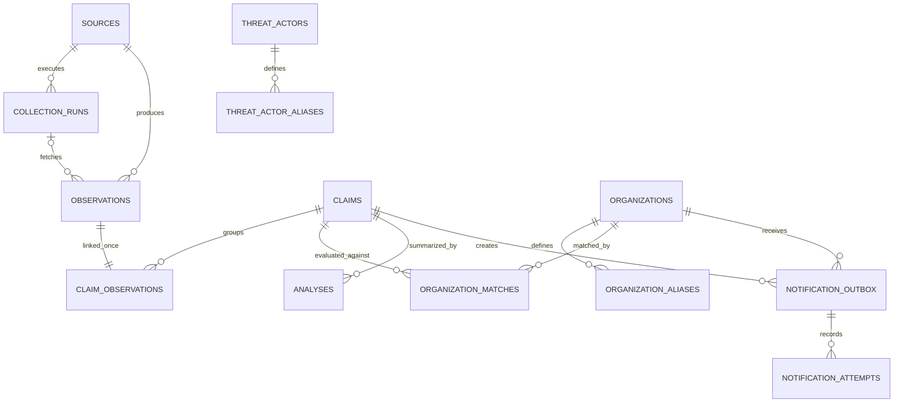

# 🗄️ Data model

## Purpose

The application schema preserves a traceable chain from external observation to analyst-facing notification. It is designed around evidence lineage, safe retries, and explicit uncertainty rather than a single flattened “incident” table.

Migration `001_initial_schema.sql` creates the foundation schema.

## Entity relationship overview

## Configuration entities

### `sources`

Defines a collection adapter and its operational state.

Important fields:

- `slug`: stable machine identifier used by workflows;
- `source_kind`: `api`, `rss`, or `json`;
- `base_url`: adapter base endpoint;
- `enabled`: collection switch;
- `poll_interval_minutes`: requested cadence;
- `metadata`: non-secret source configuration and lifecycle notes.

Secrets never belong in `metadata` or migrations.

### `organizations`

Defines a monitored legal entity or brand.

- `normalized_name` is unique;
- `domains` contains approved registered domains;
- disabled organizations retain history but do not produce new matches.

### `organization_aliases`

Contains explicitly approved alternative names or domains. Each alias defines its matching mode and deterministic confidence score.

Aliases should be narrow. Generic terms, product names, and ambiguous abbreviations must not be auto-alert aliases.

### `threat_actors` and `threat_actor_aliases`

These tables define administrator-approved canonical threat-group names and exact aliases used only for correlation identity. Normalized names are unique within each table, disabled mappings do not resolve, and a name that points to multiple enabled actors fails closed. Unknown actors remain usable under ordinary text normalization; the system never invents an alias through fuzzy similarity.

## Evidence entities

### `collection_runs`

One record represents one source execution. It captures status, timing, fetched count, inserted count, diagnostic metadata, and a sanitized error.

Collection runs support source-health reporting without depending on short-lived n8n execution logs.

### `observations`

An observation is one source’s representation of a claim.

Key invariants:

- `(source_id, source_key)` is unique;
- every observation belongs to one source;
- original and normalized victim fields coexist;
- `payload_hash` identifies the normalized raw payload;
- `is_historical` prevents baseline notifications;
- an observation can link to only one canonical claim.

`raw_payload` contains only necessary public metadata. It must not contain downloaded leaked material or secrets.

### `claims`

A claim is the platform’s canonical grouping of one or more observations believed to describe the same publication event.

It contains:

- canonical victim and actor identity;
- first and last observation timestamps;
- optional claimed date;
- lifecycle state;
- verification state;
- monotonically increasing evidence version.

The canonical key supports correlation but is intentionally not globally unique. Republishing, corrections, and distinct events involving the same victim and actor remain possible.

### `claim_observations`

Provides evidence lineage between a canonical claim and source observations. The unique constraint on `observation_id` prevents one observation from supporting multiple claims simultaneously.

## Decision entities

### `organization_matches`

Stores the deterministic result of evaluating a claim against the watchlist.

The record includes:

- matching method;
- confidence score from 0 to 100;
- evidence explaining the rule;
- review status;
- review timestamp when applicable.

Model-generated text must never populate the matching method or confidence score.

### M2 normalization and exact-candidate functions

Migrations `004_matching_normalization`, `005_exact_organization_matching`, and `008_threat_actor_aliases` add deterministic database functions without changing stored source evidence:

- `normalize_match_text` creates accent-insensitive, punctuation-separated comparison keys;
- `normalize_threat_actor` applies the text contract and then resolves explicit enabled actor aliases;
- `normalize_domain` parses and validates an ASCII hostname while failing closed on malformed values;
- `domain_matches_registered` accepts only an approved registered-domain boundary or its true subdomains;
- `extract_approved_registered_domain` returns the longest configured boundary match;
- `find_exact_organization_matches` evaluates domain, official-name, and approved exact-alias rules.

An exact candidate is `auto_accepted` only when exactly one enabled organization matches. Configuration collisions return every candidate as `pending`, even when a domain rule has nominal confidence 100. The function stores the rule version, normalized comparison evidence, candidate count, collision flag, and automatic-alert eligibility in its result.

Candidate evaluation remains read-only when called alone. Migration `006_transactional_claim_correlation` adds the transactional persistence boundary: it serializes the V1 correlation worker with a transaction-scoped advisory lock, reuses at most one exact victim/actor or domain/actor claim within 45 days, links each observation once, advances evidence versions only for new evidence, and persists exact organization matches. Migration `009_review_match_candidates` extends this boundary with pending-only token and fuzzy candidates while preserving exact and human decisions. Ambiguous existing claim candidates abort without partial writes.

### `analyses`

Stores a local-model result or deterministic fallback.

Reproducibility fields include:

- model name and optional digest;
- prompt version;
- claim evidence version;
- input hash;
- the bounded, allow-listed input payload;
- structured output;
- validation status;
- sanitized error;
- bounded inference metadata: completion reason, token counts, and duration.

The uniqueness constraint prevents repeated analysis of the same claim, prompt version, and input.
Only claims with an accepted organization match and current non-historical evidence enter the analysis queue. The database revalidates the output shape and every referenced evidence identifier before persistence. A model error stores only an allow-listed failure code translated to a fixed sanitized message; raw model or transport errors are never persisted.

## Delivery entities

### `notification_outbox`

Implements the transactional outbox pattern. A notification becomes eligible for external delivery only after its durable job exists.

The deduplication key combines the claim, organization, channel, notification type, and evidence version. Status values are:

- `pending`;
- `processing`;
- `sent`;
- `retry`;
- `dead_letter`.

### `notification_attempts`

Records every channel attempt, including timestamp, success, response status, bounded response excerpt, and sanitized error.

Response bodies must be truncated and must not persist authentication material.

## State invariants

1. Source observations are immutable evidence; corrections create new evidence or explicit state updates.
2. An observation belongs to at most one claim.
3. A match score is rule-derived and constrained to 0–100.
4. Verification state is separate from match confidence.
5. Evidence version increases when a material source or verification change should permit an update notification.
6. One logical notification key can exist only once.
7. External delivery attempts never delete their outbox parent.

## Retention

| Data | Initial policy |
|---|---|
| Sources, organizations, aliases | Retain while configuration or history references them |
| Claims and matches | Retain for project history |
| Normalized observations | Retain for history |
| Raw payload field | Minimize at ingestion; eligible for clearing after 180 days |
| Analyses | Retain with model and prompt provenance |
| Notification attempts | Retain for audit; review policy before production use |
| Successful n8n executions | 14 days |

Retention will become configurable before v1.0.0. Deletion must preserve referential integrity and the evidence required to explain sent alerts.

## Migration rules

- Migration names follow `NNN_snake_case.sql`.
- Applied migrations are never rewritten.
- Schema changes use transactions when PostgreSQL permits them.
- Migrations insert their version into `schema_migrations`.
- Constraints should enforce workflow assumptions whenever practical.
- Destructive migrations require backup, rollback, and compatibility notes.
- Seed records must contain no environment-specific secret.

## Future extensions

Possible additions include analyst comments, official confirmation evidence, source health snapshots, notification subscriptions, and retention jobs. IOC storage and vector embeddings are deliberately not part of this schema until their use cases are implemented.
