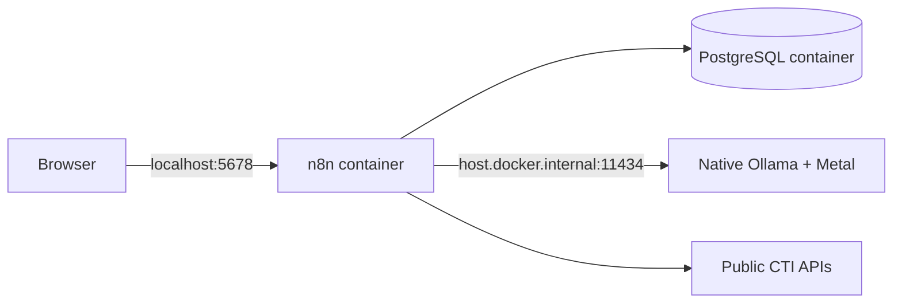

# macOS development

## Supported environment

- macOS on Apple Silicon
- Docker Desktop with Docker Compose v2
- Git
- native Ollama from Milestone 3 onward

## Why Ollama runs natively

Docker Desktop on macOS does not provide Linux containers with direct Apple Metal acceleration. Running Ollama on the host gives the local model access to native acceleration while n8n and PostgreSQL remain reproducible containers.



## Initial setup

```sh
cp .env.example .env
```

Generate independent secrets with a local cryptographic tool, for example:

```sh
openssl rand -hex 32
```

Set separate values for `POSTGRES_PASSWORD` and `N8N_ENCRYPTION_KEY`, then validate and start:

```sh
sh scripts/validate.sh
docker compose up -d
docker compose ps
```

Open <http://localhost:5678> and create the local owner account.

## Ollama

When Milestone 3 begins:

```sh
ollama pull qwen3:8b-q4_K_M
ollama list
curl http://localhost:11434/api/tags
```

The n8n container uses `http://host.docker.internal:11434`, not `localhost`, because its own loopback interface belongs to the container.

## Development loop

1. Run repository validation.
2. Start the required services.
3. Implement and test a focused workflow change.
4. Export workflows into `n8n/workflows`.
5. Inspect exports for credentials and unstable metadata.
6. Update fixtures, documentation, and the roadmap together.

## Useful commands

```sh
docker compose ps
docker compose logs --tail 100 n8n
docker compose logs --tail 100 postgres
docker compose restart n8n
docker compose down
```

Never use `docker compose down --volumes` as a routine restart command.

Create a verified local backup before a version update or other stateful
maintenance:

```sh
sh scripts/backup.sh backups
```

The generated directory contains sensitive operational data and encrypted n8n
credentials. Keep it outside Git and preserve `N8N_ENCRYPTION_KEY` separately.

## Apple Silicon runtime validation

The release-candidate stack was validated on Apple Silicon with Docker Desktop
on 2026-08-27. PostgreSQL and n8n ran as native `linux/arm64` images. n8n 2.36.7
contained vm2 3.11.6 and remained bound to localhost only.

Host-native Ollama 0.32.14 served `qwen3:8b-q4_K_M` with the pinned digest.
The n8n container reached Ollama through `host.docker.internal`, the complete
repository validation passed, and the macOS backup procedure created a verified
manifest before restarting n8n successfully.

## Resource guidance

The foundation stack is lightweight. Qwen3 8B requires substantially more memory than n8n and PostgreSQL; stop other memory-intensive applications if inference becomes slow. The smaller Qwen3 4B variant is an explicit fallback, not a silent model substitution.

## Common issues

### Ollama works on the host but not from n8n

Confirm the host endpoint, validate `OLLAMA_BASE_URL`, and check Docker Desktop host networking. Do not change the configured URL to `localhost` inside n8n.

### Port 5678 is already in use

Change `N8N_PORT` in `.env`; the container continues to listen on port 5678 internally.

### Files have unexpected executable bits

The repository defines line endings through `.gitattributes`. Shell scripts may be invoked with `sh script-name.sh`, so executable-bit differences between Windows and macOS do not affect CI.
