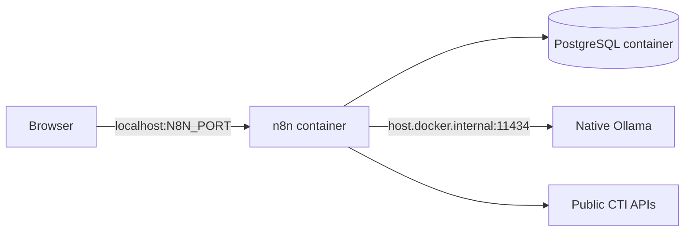

# Windows development

## Supported environment

- Windows 11
- Docker Desktop using Linux containers
- PowerShell 5.1 or PowerShell 7
- Git for Windows
- native Ollama when local AI analysis is selected

WSL2 may be used by Docker Desktop, but repository commands are designed to work directly from PowerShell.

## Architecture on Windows



PostgreSQL is not published to Windows. n8n is published only on `127.0.0.1`.

## Initial setup

```powershell
Copy-Item .env.example .env
```

Generate two independent secrets:

```powershell
$bytes = New-Object byte[] 32
[Security.Cryptography.RandomNumberGenerator]::Fill($bytes)
[Convert]::ToHexString($bytes).ToLower()
```

Place separate generated values in `POSTGRES_PASSWORD` and `N8N_ENCRYPTION_KEY`.

Validate with an execution-policy override that applies only to this process:

```powershell
powershell -NoProfile -ExecutionPolicy Bypass -File scripts/validate.ps1
```

Start the stack:

```powershell
docker compose up -d
docker compose ps
```

Then complete [workflow deployment](../operations/workflow-deployment.md). A
fresh n8n database contains no project workflows or credentials.

## Isolated clean-install validation

Before a release, reproduce first-start behavior without touching the active
development stack:

```powershell
powershell -NoProfile -ExecutionPolicy Bypass -File scripts/test_windows_installation.ps1
```

The runner assigns a unique Compose project name and uses port `25678` by
default. It creates fresh PostgreSQL and n8n volumes, verifies both databases,
all repository migrations, seeded sources, n8n version and health, localhost-only
n8n exposure, and the absence of a PostgreSQL host port. It also confirms that
the fresh n8n database contains no workflow or execution before deleting only
the isolated project's containers, networks, and volumes.

If port `25678` is already occupied, pass another unused loopback port with
`-N8nPort`. The command requires the configured local `.env` but never prints or
copies its secrets.

### Validated Windows 11 result

The isolated procedure passed on Windows 11 with Docker Desktop on 27 August
2026. A unique Compose project created both volumes from zero, started
PostgreSQL 17.10 and n8n 2.36.7, applied all 26 application migrations, and
seeded the three configured sources. The fresh n8n database contained no
workflow or execution. n8n responded through `127.0.0.1:25678`, PostgreSQL had
no host binding, and the runner removed the isolated containers, networks, and
volumes after validation. The active development stack and its volumes were not
targeted.

## Ollama

Install Ollama natively rather than adding it to the default Compose stack when
the local analysis provider is selected:

```powershell
ollama pull qwen3:8b-q4_K_M
ollama list
```

n8n reaches the host service through `http://host.docker.internal:11434`.

## Development loop

1. Start Docker Desktop.
2. Run the validation script.
3. Start or update the Compose stack.
4. Implement and test one bounded workflow change.
5. Export workflows to `n8n/workflows`.
6. Remove credentials and unstable editor metadata from exports.
7. Review the Git diff and update documentation.

## Useful commands

```powershell
docker compose ps
docker compose logs --tail 100 n8n
docker compose logs --tail 100 postgres
docker compose restart n8n
docker compose down
```

Do not add `--volumes` to `docker compose down` unless local data deletion is intentional.

## Common issues

### Docker command not found

Install and start Docker Desktop, close existing terminals, and open a new PowerShell session so the Docker CLI is added to `PATH`.

### PowerShell blocks the validation script

Use the documented `-ExecutionPolicy Bypass` command. It does not permanently weaken the machine-wide policy.

### Ollama is unreachable from n8n

Confirm Ollama responds on Windows, verify `OLLAMA_BASE_URL`, and check that Docker Desktop resolves `host.docker.internal`.

### OneDrive synchronization

Keep the working repository outside OneDrive and other live synchronization
folders when possible, for example `C:\Dev\threat-claim-monitor`. Docker data is
stored in named volumes, but synchronization can still interfere with `.git`
lock files, rebases, directory deletion, and executable metadata. Stop commands,
copy or clone the repository to the new location, verify `git status` and
`git fsck --full`, then resume work. Do not move a running repository.
