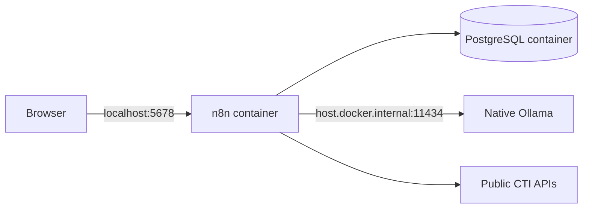

# Windows development

## Supported environment

- Windows 11
- Docker Desktop using Linux containers
- PowerShell 5.1 or PowerShell 7
- Git for Windows
- Ollama for Windows from Milestone 3 onward

WSL2 may be used by Docker Desktop, but repository commands are designed to work directly from PowerShell.

## Architecture on Windows



PostgreSQL is not published to Windows. n8n is published only on `127.0.0.1`.

## Initial setup

```powershell
Copy-Item .env.example .env
```

Generate two independent secrets:

```powershell
$bytes = New-Object byte[] 32
[Security.Cryptography.RandomNumberGenerator]::Fill($bytes)
[Convert]::ToHexString($bytes).ToLower()
```

Place separate generated values in `POSTGRES_PASSWORD` and `N8N_ENCRYPTION_KEY`.

Validate with an execution-policy override that applies only to this process:

```powershell
powershell -NoProfile -ExecutionPolicy Bypass -File scripts/validate.ps1
```

Start the stack:

```powershell
docker compose up -d
docker compose ps
```

## Ollama

Install Ollama natively rather than adding it to the default Compose stack. Later milestones use:

```powershell
ollama pull qwen3:8b-q4_K_M
ollama list
```

n8n reaches the host service through `http://host.docker.internal:11434`.

## Development loop

1. Start Docker Desktop.
2. Run the validation script.
3. Start or update the Compose stack.
4. Implement and test one bounded workflow change.
5. Export workflows to `n8n/workflows`.
6. Remove credentials and unstable editor metadata from exports.
7. Review the Git diff and update documentation.

## Useful commands

```powershell
docker compose ps
docker compose logs --tail 100 n8n
docker compose logs --tail 100 postgres
docker compose restart n8n
docker compose down
```

Do not add `--volumes` to `docker compose down` unless local data deletion is intentional.

## Common issues

### Docker command not found

Install and start Docker Desktop, close existing terminals, and open a new PowerShell session so the Docker CLI is added to `PATH`.

### PowerShell blocks the validation script

Use the documented `-ExecutionPolicy Bypass` command. It does not permanently weaken the machine-wide policy.

### Ollama is unreachable from n8n

Confirm Ollama responds on Windows, verify `OLLAMA_BASE_URL`, and check that Docker Desktop resolves `host.docker.internal`.

### OneDrive synchronization

The repository may live inside OneDrive, but container data is stored in named Docker volumes rather than synchronized folders. Avoid moving a running repository or editing generated runtime data through OneDrive.

