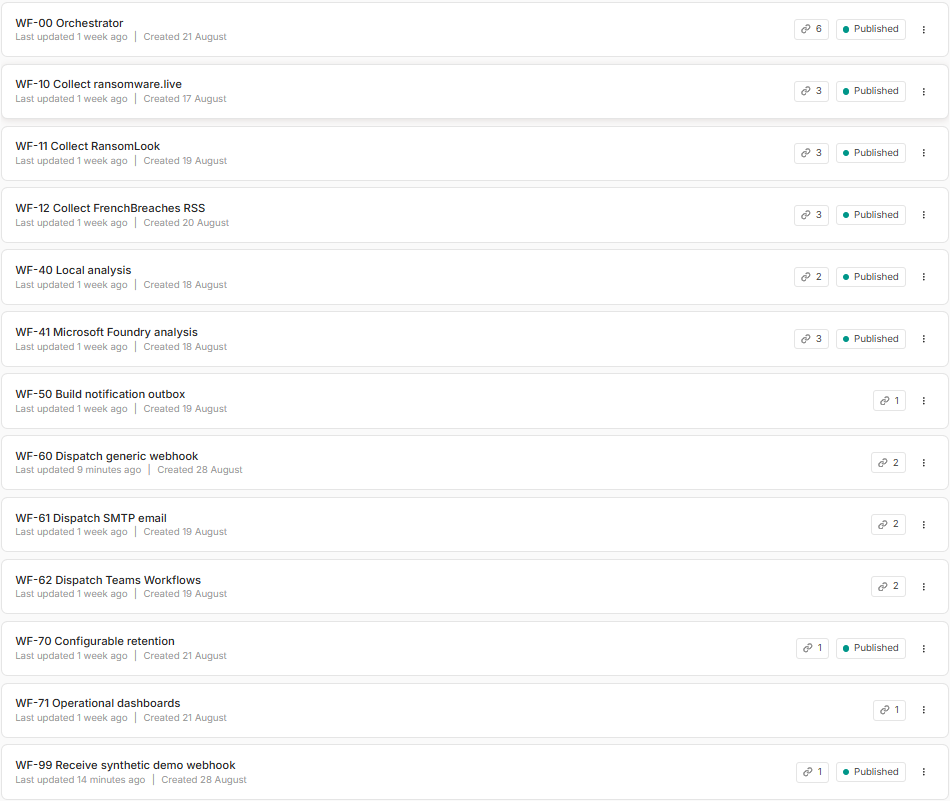
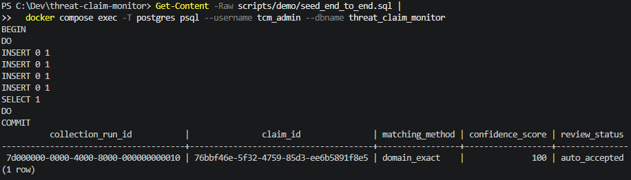
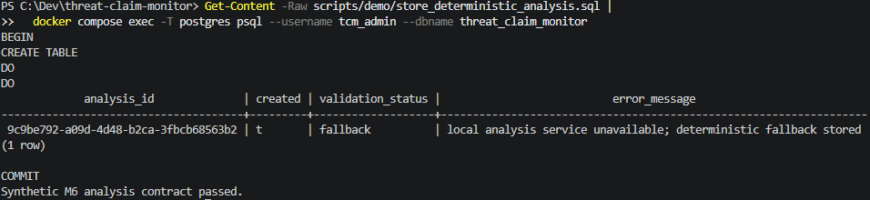
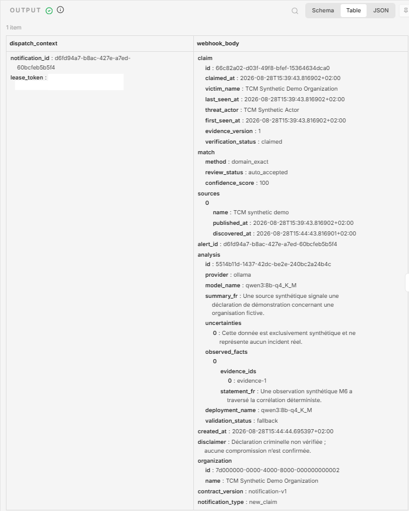
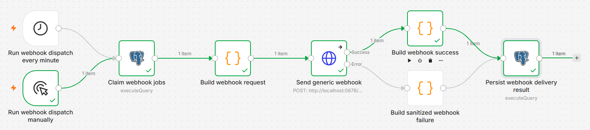
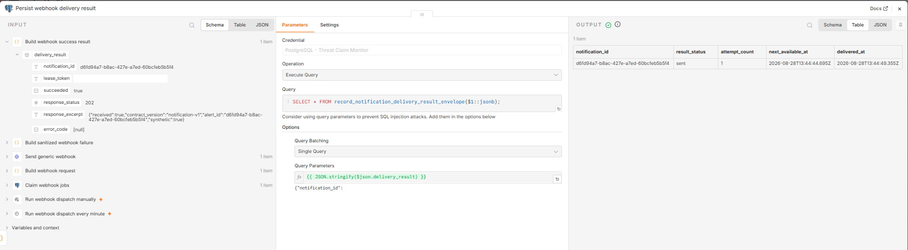

# V1 release demonstration

This guide turns the repository-safe synthetic scenario into a short V1
demonstration. It is intended for a reviewer who has not seen the project
before. The complete demonstration should take about five minutes after the
local stack and workflows have been configured.

Use only the fixed synthetic scenario documented in the [end-to-end synthetic
demonstration](end-to-end-synthetic-demo.md). Do not use a live source record,
an operator watchlist, or a real notification destination as release
evidence.

## Story to present

1. Three independent public-source adapters produce one bounded observation
   contract.
2. PostgreSQL correlates evidence and performs deterministic organization
   matching; the language model never decides the match.
3. Exactly one explicitly selected provider summarizes bounded evidence, with a
   deterministic fallback when inference is unavailable.
4. A transactional outbox delivers one sanitized notification and preserves
   its attempt history.
5. The local reference deployment keeps n8n on loopback and PostgreSQL on an
   internal Docker network.

State the central limitation clearly: a criminal publication is an unverified
claim, not confirmation that an organization was compromised.

## Capture set

Store approved PNG files under `docs/assets/release-demo/` using these names. Keep
the source screenshots outside Git until the review below has passed.

| File | Capture | Required visible evidence |
|---|---|---|
| `01-workflows.png` | n8n workflow list | Reviewed V1 workflow names and the active state needed for the demonstration |
| `02-synthetic-correlation.png` | Synthetic correlation result | Synthetic collection or claim identifier, `domain_exact`, confidence `100`, and `auto_accepted` |
| `03-synthetic-analysis.png` | Synthetic analysis persistence | Provider or fallback status and the successful synthetic-analysis contract result |
| `03-build-request-output.png` | Bounded notification payload | French summary, synthetic facts and uncertainties, disclaimer, and no raw source payload or authentication value |
| `04-local-webhook-delivery.png` | Local webhook execution | Successful local dispatch path without a real notification destination |
| `04-persist-webhook-delivery.png` | Delivery persistence result | One synthetic notification identifier, `sent`, attempt count `1`, and delivery timestamp |

Crop each image to the smallest useful area. Prefer a native-resolution PNG;
do not add decorative browser chrome, unrelated executions, terminal history,
desktop notifications, or personal bookmarks.

## Approved V1 evidence

### Workflow inventory

### Deterministic correlation

### Bounded analysis

### Transactional notification delivery

## Mandatory sanitization review

Review both the visible pixels and the filename before copying any image into
the repository. Reject the capture if it contains any of the following:

- a real organization, victim, employee, tenant, account, or email address;
- an API key, password, token, cookie, authorization header, credential value,
  webhook signature, or URL containing `sig=`;
- a Microsoft Foundry endpoint, deployment endpoint, subscription identifier,
  resource-group identifier, or other tenant metadata;
- a public-source raw payload, criminal-infrastructure link, stolen-content
  reference, or unnecessary execution headers;
- an operator filesystem path, browser profile, workstation name, IP address,
  notification destination, or unrelated workflow execution;
- an n8n credential identifier or a value from `.env`.

Redaction must be irreversible in the exported PNG. Do not place a translucent
shape over sensitive text. Crop the field out or replace the capture with a
synthetic view. Remove image metadata before publication and reopen the final
file to inspect it at 100% zoom.

The only organization name approved for the end-to-end capture is
`TCM Synthetic Demo Organization`. Identifiers generated by the synthetic scenario
may be shown, but no authentication value may appear.

## Demonstration sequence

1. Confirm the reference stack is local and the real notification channels are
   disabled.
2. Run the synthetic seed, correlation, analysis, outbox, and preflight steps
   from the end-to-end guide.
3. Execute WF-60 once and confirm WF-99 receives exactly one local request.
4. Run `verify_end_to_end.sql` and confirm its final success line.
5. Capture the six bounded views, sanitize them, and perform the review above.
6. Run `cleanup_end_to_end.sql`, restore the previous local workflow settings,
   and confirm no demonstration row remains.

## Suggested five-minute narration

- **Minute 1 — purpose and boundaries:** explain the unverified-claim model,
  synthetic data, and localhost-only reference deployment.
- **Minute 2 — collection and matching:** show the adapter separation and the
  exact, explainable match result.
- **Minute 3 — analysis:** show bounded evidence, explicit local/cloud routing,
  and deterministic fallback.
- **Minute 4 — notification:** show the outbox result and exactly one local
  webhook delivery with the mandatory disclaimer.
- **Minute 5 — operations:** point to backup/restore, retention, dashboards,
  security scanning, support routes, and the known production limitations.

Do not improvise a live-source demonstration for a recording or public review.
If the synthetic run fails, stop, clean it up, diagnose it locally, and capture
new evidence only after the complete scenario passes.

## Final publication check

Before the release pull request is merged:

- all six files exist with the exact names above and render from a clean clone;
- every visible organization and domain is synthetic;
- the screenshots agree with the tagged workflow and notification contracts;
- no image contains a secret or private operational identifier;
- the release notes link to this guide, not to temporary local evidence;
- the synthetic database rows and temporary WF-60/WF-99 configuration have
  been removed or restored.
