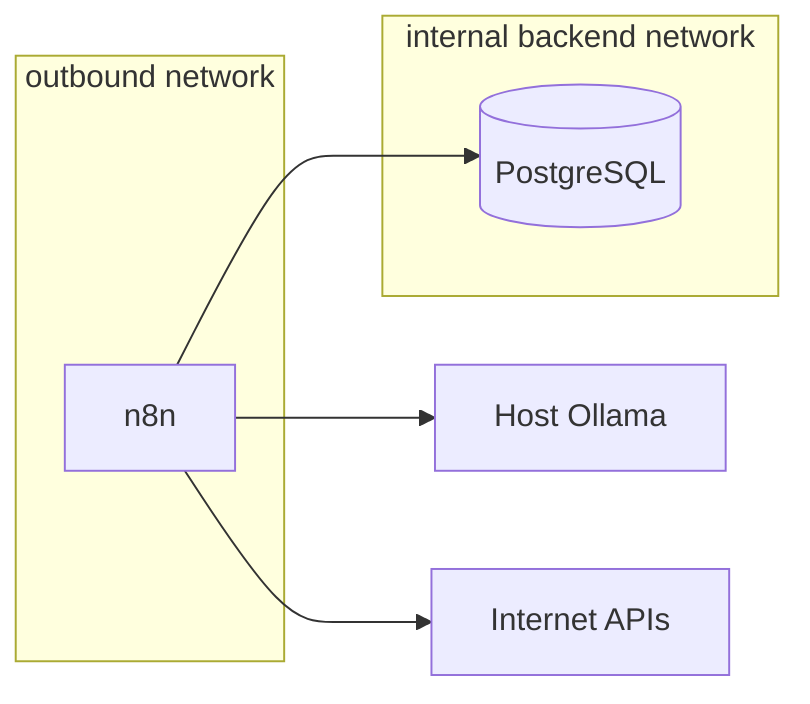

# Docker infrastructure

## Overview

The reference infrastructure runs n8n and PostgreSQL with Docker Compose. Ollama remains a native host service and is reached through `host.docker.internal`.

## Topology



PostgreSQL joins only the internal `backend` network. n8n joins both `backend` and `outbound` because it must reach CTI and notification endpoints.

## Services

| Service | Image | Persistence | Host port |
|---|---|---|---|
| PostgreSQL | `postgres:${POSTGRES_VERSION}` | `postgres_data` | None |
| n8n | `docker.n8n.io/n8nio/n8n:${N8N_VERSION}` | `n8n_data` | `127.0.0.1:${N8N_PORT}` |

Images are pinned through `.env.example`. Do not replace them with `latest` in committed configuration.

## Initialization

On an empty PostgreSQL volume, `infra/postgres/init/00-initialize.sh`:

1. keeps the default `n8n` database created by the official image;
2. creates `threat_claim_monitor`;
3. applies ordered SQL files from `db/migrations`.

Official image initialization runs only for a new data volume. Later migrations are applied explicitly according to the operations guide until a dedicated migration job exists.

## Volumes

| Volume | Contents | Consequence of deletion |
|---|---|---|
| `postgres_data` | Both databases and application history | Loss of workflows’ durable backend and CTI history |
| `n8n_data` | n8n local state and settings | Loss of local n8n state; credentials may become inaccessible |

Volume deletion is not a troubleshooting shortcut. Use `docker compose down` without `--volumes` for routine stops.

## Configuration

`.env.example` documents non-secret defaults and required secret names. The actual `.env` file is ignored by Git.

Required secrets:

- `POSTGRES_PASSWORD`;
- `N8N_ENCRYPTION_KEY`.

The encryption key must remain stable across restarts and restores.

## Security posture

- PostgreSQL has no host port.
- n8n listens on loopback only.
- diagnostics and personalization are disabled.
- execution pruning is enabled.
- settings-file permission enforcement is enabled.
- source and notification credentials belong in n8n credentials, not workflow exports.

The local HTTP configuration is suitable only because n8n binds to localhost.
Private remote administration may preserve this boundary through an SSH tunnel
or approved VPN. Public HTTPS deployment requires a separate reverse-proxy,
authentication, task-runner, backup, and monitoring review; see [remote
administration](../docs/operations/remote-administration.md).

## Validation

Windows:

```powershell
powershell -NoProfile -ExecutionPolicy Bypass -File scripts/validate.ps1
```

macOS or Linux:

```sh
sh scripts/validate.sh
```

CI runs the same Compose validation on every pull request.
